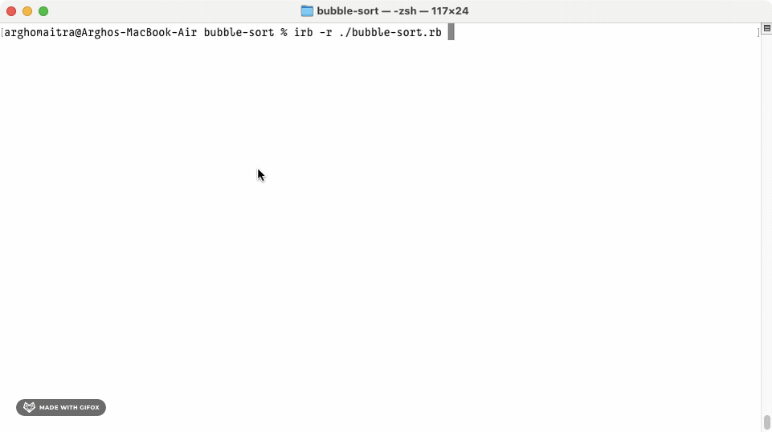

# bubble-sort
One of the Simplest and Processor-Intensive Sorting Algorithm

## Demo

## General Info

**bubble-sort** is the [fourth project](https://www.theodinproject.com/lessons/ruby-bubble-sort) in the [Ruby Course](https://www.theodinproject.com/paths/full-stack-ruby-on-rails/courses/ruby) from the [Full Stack Ruby on Rails](https://www.theodinproject.com/paths/full-stack-ruby-on-rails) path in the [The Odin Project](https://www.theodinproject.com/about).

## Technologies

+ ***CLI***
+ ***Git***
+ ***GitHub***
+ ***Ruby***

## Self-reflections

> It took quite some time to reach here. I always keep the stuff I learnt about motivation and mindset in the beginning part of the odin project close to my heart. It has proved valuable in overcoming many of the challenges that I've faced as of now.

> This was not that easy compared to the previous three project but interesting nonetheless. I learned a whole lot about installing Ruby and all the different basic Ruby tidbits prior to starting this project. The project specifications (i.e., the video and the article) provide enough information on how to tackle the pseudocode for this problem. I also liked the numerous optimizations to the pseudocode mentioned in the article.

## Contact and Support

+ Feel free to contact ***mitrohgr_03505*** on discord for project-related queries.
+ No further feature modifications or improvements will be done to this project.